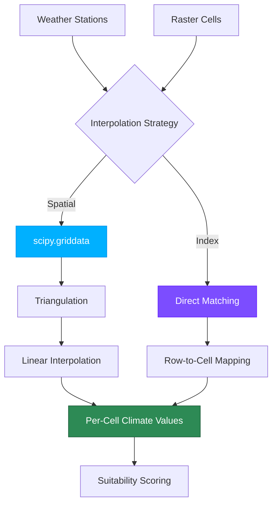

# ADR-003: Climate Data Interpolation Strategies

**Status**: Accepted  
**Date**: 2026-02-06  
**Deciders**: TerraFlow Contributors

## Context

Previously, TerraFlow applied a single global mean climate value to all sampled raster cells in a ROI. This approach:
- Ignored spatial variation in climate across the region
- Reduced model accuracy for geographically diverse regions
- Limited applicability to large-scale agricultural analysis

We needed a system to apply per-cell climate values while supporting different data sources and matching strategies.



## Decision

Implement `ClimateInterpolator` with two configurable strategies:

### 1. **Spatial Interpolation Strategy** (Default)

**Use case**: Climate data with lat/lon coordinates (point observations, station networks, gridded data)

**Implementation**: `scipy.interpolate.griddata` with linear interpolation
- Triangulates climate observation points
- Interpolates values for each raster cell based on its geographic location
- Falls back to nearest-neighbor if insufficient data for linear triangulation
- Uses global mean as fallback for cells outside interpolation convex hull

**Advantages**:
- ✅ Supports arbitrary observation locations
- ✅ Produces smooth spatial gradients
- ✅ Graceful fallback for sparse data
- ✅ No strict requirement for exact cell-to-record mapping

**Limitations**:
- Requires ≥3 observation points for proper triangulation
- Extrapolation beyond convex hull uses fallback (mean)

### 2. **Index-Based Matching Strategy**

**Use case**: Climate data aligned by row index (e.g., pre-processed per-cell datasets)

**Implementation**: Direct row-to-cell matching
- Climate CSV row i → Raster cell i
- Optional `cell_id_column` for explicit ID-based matching (future enhancement)
- Flexible handling of mismatched counts with fallback to mean

**Advantages**:
- ✅ Fast (no interpolation computation)
- ✅ Deterministic (no randomness in interpolation)
- ✅ Works with any data volume

**Limitations**:
- Requires data to be pre-aligned to cells
- Less suitable for point observation data

## Implementation Details

### Configuration

```yaml
# config.yml
climate:
  strategy: "spatial"  # or "index"
  cell_id_column: null  # optional, for index matching with explicit IDs
  fallback_to_mean: true  # use global mean for missing/extrapolated values
```

### Validation

Climate CSV must have:
- `lat` column: latitude in [-90, 90]
- `lon` column: longitude in [-180, 180]
- ≥1 climate variable column (e.g., `mean_temp`, `total_rain`)

Warnings logged for:
- Duplicate coordinates
- NaN values in climate variables
- Sparse data requiring fallback

### Code Integration

```python
from terraflow.climate import ClimateInterpolator
from terraflow.ingest import load_climate_csv

# Load climate data
climate_df = load_climate_csv("climate.csv")

# Create interpolator with config strategy
interpolator = ClimateInterpolator(
    climate_df=climate_df,
    strategy=cfg.climate.strategy,
    cell_id_column=cfg.climate.cell_id_column,
    fallback_to_mean=cfg.climate.fallback_to_mean
)

# Get per-cell climate values
cell_climate = interpolator.interpolate(cell_lats, cell_lons)
```

## Consequences

### Positive
- ✅ Per-cell climate variation improves model accuracy
- ✅ Supports both observation-based and pre-processed climate data
- ✅ Graceful handling of incomplete/sparse data
- ✅ Backward compatible with existing ROI/raster workflows
- ✅ Foundation for future temporal analysis (time series interpolation)

### Negative
- ⚠️ ~6 ms per cell overhead for spatial interpolation (acceptable for <10K cells)
- ⚠️ Requires climate data with valid coordinates (breaking change for old-style CSVs)
- ⚠️ Adds scipy dependency

### Neutral
- Requires config update for explicit strategy selection (defaults to spatial)

## Alternatives Considered

### 1. Nearest-Neighbor Only
- **Rejected**: Less smooth gradients, discontinuities at observation boundaries

### 2. Kriging Interpolation
- **Rejected**: Higher computational cost, requires variogram fitting
- Can revisit for optional advanced mode (future)

### 3. Pre-computed Interpolation Grids
- **Rejected**: Requires external preprocessing, less flexible
- Can combine with current approach (accept pre-interpolated climate)

## Related Decisions

- **ADR-001**: Single-band raster processing (climate respects this constraint)
- **ADR-002**: BBox ROI only (climate interpolation works within ROI)

## Future Enhancements

1. **Temporal Interpolation**: Extend to monthly/seasonal climate variation
2. **Advanced Interpolation**: Optional kriging for statistically rigorous analysis
3. **Multi-Variable Weighting**: Interpolate with variable-specific weights
4. **Climate Data Sources**: Direct integration with climate APIs (ERA5, MERRA2)
5. **Per-Cell Climate Attribution**: Track which observations influenced each cell's estimate
