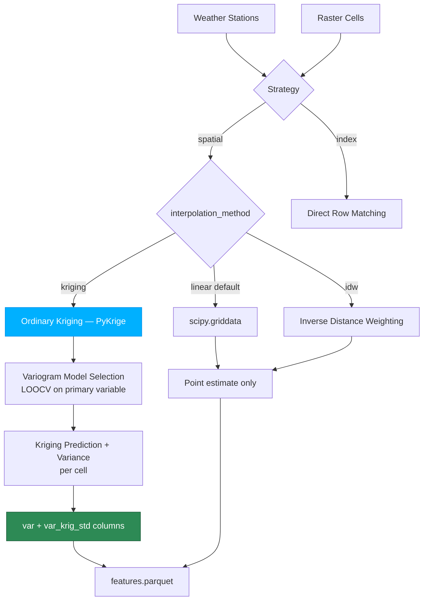

# ADR-005: Ordinary Kriging as Recommended Spatial Interpolation

**Status**: Accepted
**Date**: 2026-03-15
**Deciders**: TerraFlow Contributors

## Context

ADR-003 introduced `scipy.interpolate.griddata` (Delaunay-triangulation linear
interpolation) as TerraFlow's default climate interpolation method.  This
choice was appropriate for an initial release but has significant scientific
limitations that limit TerraFlow's credibility for agricultural decision
support:

1. **No uncertainty estimate**: `griddata` returns a single point estimate
   with no associated error.  Users cannot distinguish confident predictions
   (dense station network) from unreliable ones (sparse network).

2. **Silent global-mean fallback**: cells outside the convex hull of stations
   receive the global mean climate value — not nearest-neighbour, not a
   physically meaningful extrapolation.  This is scientifically incorrect and
   opaque to users.

3. **No model of spatial autocorrelation**: linear interpolation treats all
   station-to-cell distances identically regardless of the spatial covariance
   structure of the climate field.  Climate fields are spatially correlated;
   ignoring this produces biased estimates near cluster boundaries.

4. **No cross-validation**: there is no mechanism to quantify interpolation
   accuracy.  The paper cannot make quantitative claims such as "temperature
   interpolation RMSE = X °C."

Ordinary Kriging (Matheron 1963; Cressie 1993, *Statistics for Spatial Data*)
directly addresses all four weaknesses.  It is the **Best Linear Unbiased
Predictor** (BLUP) for spatially correlated random fields and is the algorithm
underlying operational climate mapping products (PRISM, WorldClim, CHELSA).



## Decision

Introduce `interpolation_method` as a new `ClimateConfig` field
(`"linear"` | `"kriging"` | `"idw"`).  The default remains `"linear"` for
backward compatibility.  Users opt into kriging via:

```yaml
climate:
  strategy: "spatial"
  interpolation_method: "kriging"
```

### Ordinary Kriging Implementation

- **Library**: `pykrige>=1.7` (BSD-3-Clause, pure Python, numpy/scipy)
- **Algorithm**: `pykrige.ok.OrdinaryKriging`
- **Variogram model selection**: at initialisation, TerraFlow fits three
  variogram models (spherical, exponential, Gaussian) and selects the one
  with the lowest LOOCV RMSE on the first climate variable.
- **Minimum stations**: `MIN_KRIGING_STATIONS = 5`.  Below this threshold,
  kriging falls back to `"linear"` with a warning — variogram estimation is
  unreliable with fewer than 5 lag pairs (N < 5 stations → < 10 pairs).
- **Uncertainty output**: each climate variable produces a `{var}_krig_std`
  column in `features.parquet` containing the kriging prediction standard
  deviation (√kriging variance) per cell.
- **Numerical stability**: `sigma_sq` values are clipped to `[0, ∞)` before
  taking the square root to avoid NaN from small numerical negatives near
  station locations.

### Cross-Validation (LOOCV)

At initialisation, when kriging is selected:

1. Variogram model selection: LOOCV RMSE computed for each model on the first
   climate variable.  Best model selected.
2. Full LOOCV: RMSE and MAE computed for all climate variables using the
   selected model.
3. Results stored in `ClimateInterpolator.cv_metrics` and written to
   `report.json` under `interpolation_cv`.

This gives TerraFlow a quantitative, independently verifiable accuracy claim.

### IDW as a Lightweight Alternative

IDW (power=2) is added as `interpolation_method="idw"`:

- No extra dependencies (numpy only)
- No uncertainty estimate
- Deterministic, fast
- Better than `griddata` for sparse station networks (no extrapolation to
  global mean — the weighted average inherently handles domain boundaries)

## Consequences

### Positive

- ✅ Kriging is geostatistically optimal (BLUP) — scientifically defensible
- ✅ Per-cell `{var}_krig_std` enables uncertainty-aware downstream analysis
  (Stage 2: Monte Carlo uncertainty propagation)
- ✅ LOOCV RMSE in `report.json` provides a quantitative accuracy claim for
  the JOSS paper
- ✅ Variogram model selection is automatic — users do not need geostatistics
  expertise
- ✅ Backward compatible: existing configs without `interpolation_method`
  default to `"linear"`, unchanged behaviour
- ✅ Graceful fallback: sparse networks fall back to `"linear"` automatically

### Negative

- ⚠️ `pykrige>=1.7` added as a hard dependency (~8 MB, BSD-3-Clause)
- ⚠️ LOOCV at init adds wall-clock time O(N²) in OrdinaryKriging fits;
  negligible for N < 100 stations, noticeable for N > 500
- ⚠️ Kriging assumes second-order stationarity of the climate field — violated
  in regions with strong topographic gradients (e.g., mountain ranges).
  Universal Kriging with elevation as a covariate would be more appropriate
  in such cases but is deferred to a future release.

### Neutral

- `interpolation_method` only affects `strategy="spatial"` runs; index
  matching is unchanged.

## Alternatives Considered

### 1. Keep scipy.griddata as the Only Method

**Rejected**: provides no uncertainty, global-mean fallback is scientifically
incorrect, and cannot make quantitative accuracy claims in the paper.

### 2. Universal Kriging with Elevation Covariate

**Deferred**: more accurate in mountainous terrain but requires an elevation
raster as an additional input, increasing user friction significantly.  Planned
as a future enhancement alongside multi-raster support.

### 3. Gaussian Process Regression (scikit-learn)

**Rejected**: equivalent to kriging but higher overhead; requires scikit-learn
(large dependency).  PyKrige is purpose-built for geostatistical kriging with
a simpler API.

## Related Decisions

- **ADR-003**: prior climate interpolation strategy — superseded for the
  recommended path, preserved as `interpolation_method="linear"`
- **ADR-001**: single-band raster — kriging operates on per-cell centroids,
  unchanged by band count

## Future Enhancements

1. **Universal Kriging**: covariate-informed interpolation (elevation,
   topographic wetness index) for accuracy in non-stationary fields
2. **Monte Carlo uncertainty propagation**: sample from `Normal(krig_mean,
   krig_std)` per cell to propagate interpolation uncertainty through the
   suitability model (Stage 2 of the research roadmap)
3. **Temporal kriging**: extend to monthly/seasonal climate surfaces
4. **Space–time kriging**: for multi-year yield prediction workflows
