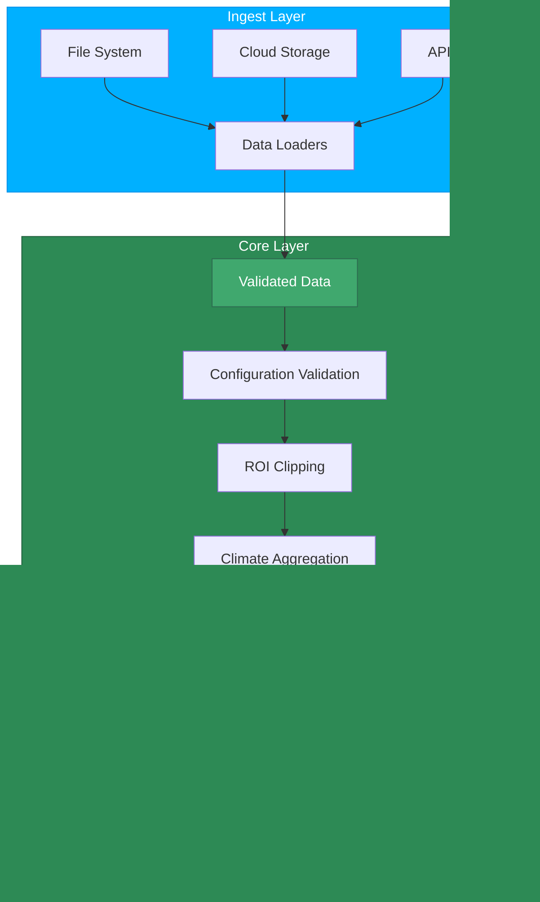

# Architecture Boundaries

TerraFlow splits the pipeline into two primary layers:

## Ingest layer

Ingest-layer details will be finalized later.

## Core layer

The core layer:

- Validates configuration.
- Clips raster data to the ROI.
- Aggregates climate metrics.
- Computes suitability scores and labels.
- Writes run artifacts.

The core layer should not contain any file system discovery or remote fetch logic; it relies on ingest to
provide all data.

## Why the boundary matters

Keeping ingestion and core computation separate ensures that:

!!! tip "Deterministic & Testable"
    Pipeline logic remains deterministic and testable without filesystem dependencies.

!!! tip "Extensible Data Sources"
    Future data sources (e.g., cloud buckets) can be added without rewriting scoring logic.

!!! tip "Audit-Friendly"
    The system remains audit-friendly for reproducible research with clear data provenance.
