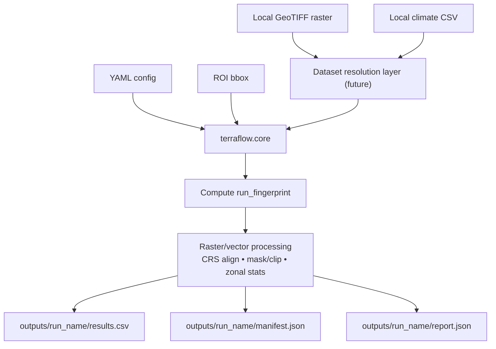

# TerraFlow Overview

TerraFlow is a reproducible geospatial modeling framework that turns local geospatial inputs into
traceable, analysis-ready artifacts. The core pipeline focuses on deterministic processing of
region-of-interest (ROI) geographies and raster stacks so that every run can be recreated and
audited with confidence.

## Inputs (v0.2.0)

- YAML configuration file.
- ROI boundary defined in the YAML (bbox in v0.1 examples).
- Local GeoTIFF raster input (for example, `data/usda_cdl.tif`).
- Local climate CSV input with lat/lon coordinates (for example, `data/demo_climate.csv`) — **enhanced in v0.2.0 with spatial interpolation**.

## Outputs (v0.2.0 stable contract)

All outputs are written under a deterministic run directory:

```
outputs/<run_name>/
```

- `results.csv`: extracted features and scores per sampled cell (now with **per-cell climate values in v0.2.0**).
- `manifest.json`: canonicalized inputs, file fingerprints, and provenance metadata.
- `report.json`: QA summaries, timing, and coverage statistics.

For example, a demo configuration that sets `output_dir: "outputs/demo_run"` will emit
`outputs/demo_run/results.csv` alongside the manifest and report.

## Canonical pipeline



## How a run works

1. **Load configuration** and normalize relevant settings.
2. **Load and normalize the ROI** geometry for consistent spatial operations.
3. **Resolve local datasets** via the dataset resolution layer (future) for raster and climate sources.
4. **Compute the run_fingerprint** deterministically.
5. **Execute raster/vector processing** for clipping, masking, and zonal statistics.
6. **Write outputs** with timings and QA summaries for inspection.

## Reproducibility

The `run_fingerprint` is a base64-url-safe hash derived from canonicalized configuration, a
stable ROI geometry hash, and fingerprints of the input files. This makes each run immutable
and comparable. The `manifest.json` captures the canonical inputs and file fingerprints, while
`report.json` records timing and QA summaries that explain what the run produced.

## Geospatial correctness

TerraFlow treats geospatial correctness as a first-class concern:

- **CRS strategy:** ROI geometries are normalized and aligned to raster CRS expectations before
  extraction begins.
- **Clipping and masking:** raster data is clipped and masked to the ROI boundary to avoid
  leaking pixels outside the target geography.
- **NoData propagation:** nodata values are preserved through processing to prevent false
  statistics.
- **Coverage checks:** `report.json` summarizes nodata ratios and coverage statistics so runs can
  be audited for spatial completeness.

## Non-goals (v0.1)

- Remote dataset downloads or cloud-hosted sources.
- A hosted platform, workflow engine, or orchestration service.
- A GUI-first GIS tool.
- A general-purpose raster processing library.
