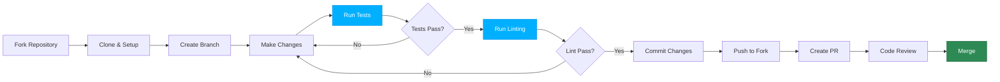

# Contributing

Thanks for helping improve TerraFlow! Here are the basics for v0.5.0+.

## Contribution Workflow



## Local setup

```bash title="Quick Setup"
make dev
```

This creates a virtual environment and installs development dependencies.

!!! tip "Prerequisites"
    - Python 3.9 or higher
    - `make` command (or run commands from Makefile manually)
    - Git for version control

## Run tests

```bash title="Test Suite"
make test
```

!!! success "Test Coverage"
    Aim for >80% coverage for new features. Check coverage report in `htmlcov/index.html`

## Linting

```bash title="Code Quality"
make lint
```

!!! warning "Pre-commit Requirement"
    All code must pass `black` formatting and `ruff` linting before PR approval.

## Documentation

Install docs dependencies and run a local preview:

=== "Preview Docs"

    ```bash
    uv pip install -r docs/requirements.txt
    mkdocs serve
    ```
    
    Open http://127.0.0.1:8000 in your browser

=== "Build & Validate"

    ```bash
    mkdocs build --strict
    ```
    
    Validates all links and ensures no warnings

!!! example "Documentation Standards"
    - Add docstrings to all public functions (NumPy style)
    - Update relevant `.md` files for user-facing changes
    - Create ADRs for significant architectural decisions
