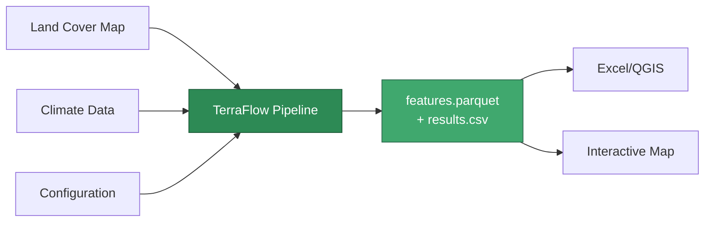

# Field Guide — Understanding TerraFlow Results

*For land managers, agricultural consultants, extension agents, and anyone who uses the outputs without writing the code.*

No programming knowledge is needed to read this page.

---

## What does TerraFlow actually do?

Think of it like a soil survey — but automated, repeatable, and done in seconds.

TerraFlow looks at a patch of land (a region you define by its corners on a map) and asks: **"How good is this land for growing a particular crop, given current temperature and rainfall conditions?"**

It does this for hundreds of specific locations within your region, assigns each one a score, and hands you a spreadsheet.

---

## What data goes in

You (or your technical team) prepare three things:

### 1. A land-cover map
This is a satellite-derived image that divides the land into pixels. Each pixel has a number representing what's there — cropland, pasture, forest, water, built-up area, etc.

The most common source in the US is the **USDA Cropland Data Layer (CDL)**, which is freely available and updated annually.

!!! note
    You do not need to process this file. Your technical team handles it.

### 2. A climate file
A table of readings from nearby weather stations. Each row is one station with:
- Its location (latitude and longitude)
- Average temperature (°C)
- Total rainfall (mm)

The tool automatically fills in the climate for every location on the map by interpolating between your stations — like drawing contour lines between measurement points.

### 3. A configuration file
A short text file where your technical team sets:
- Which region of the map to analyse (the "region of interest")
- What temperature and rainfall ranges your crop needs
- How much each factor matters (the "weights")

---

## What comes out

TerraFlow writes a file called `results.csv`. It is a spreadsheet with one row per sampled location. You can open it in Excel, Google Sheets, or any mapping software.

### Column meanings

| Column | Plain English |
|---|---|
| `lat` | Latitude of this location (decimal degrees, e.g. 39.14) |
| `lon` | Longitude of this location (decimal degrees, e.g. -100.82) |
| `v_index` | The raw value from the land-cover map at this pixel |
| `mean_temp` | Estimated temperature (°C) at this location |
| `total_rain` | Estimated rainfall (mm) at this location |
| `score` | Suitability score: **0 = completely unsuitable, 1 = perfectly suitable** |
| `label` | Quick-read label: **low / medium / high** |

### What the labels mean

| Label | Score range | What it suggests |
|---|---|---|
| **high** | 0.67 – 1.0 | Strong candidate — climate and land conditions align with target crop requirements |
| **medium** | 0.33 – 0.67 | Possible — one or more factors are marginal; consider supplemental irrigation or variety selection |
| **low** | 0.0 – 0.33 | Poor fit — temperature, rainfall, or land cover is significantly outside the target range |

!!! warning "Important Context"
    The score reflects the conditions you configured. If your team set the thresholds for wheat, a "high" score means conditions are good for wheat — not necessarily for every crop.

---

## How to read results in Excel

1. Open `results.csv` in Excel.
2. Select all → Insert → Table (so headers are locked).
3. Filter the `label` column to show only **"high"** rows.
4. Sort by `score` descending to see the best locations first.

To map the results:
- In Google Sheets: use the `lat` and `lon` columns with a mapping add-on.
- In QGIS (free): File → Import CSV, use `lon` as X and `lat` as Y, set CRS to EPSG:4326.
- In ArcGIS: Add XY Data, same columns.

---

## Frequently asked questions

???+ faq "The region I care about is not in the results — why?"
    The results only cover locations *within* the bounding box your team configured, and only up to the `max_cells` limit. Ask your technical team to expand the region or increase the cell limit.

???+ faq "Two locations have the same score but different temperatures — is that normal?"
    Yes. The score combines three factors (vegetation index, temperature, and rainfall), each with a weight. Two locations can reach the same total score through different combinations.

???+ faq "Can I trust the lat/lon values to load into my GPS or GIS?"
    Yes. TerraFlow always outputs coordinates in decimal degrees (WGS84), which is the standard used by GPS devices, Google Maps, and all major GIS software.

???+ faq "The score is 0.72 — is that good?"
    That depends entirely on what thresholds your team configured. A score of 0.72 always means "high" (above 0.67), but whether that's a strong candidate depends on your crop's actual requirements. Discuss the thresholds with whoever set up the configuration.

???+ faq "I have last year's results and this year's results — can I compare them?"
    Yes, and that's one of TerraFlow's key features. Because the same configuration always produces the same sampling pattern, you can directly compare scores across years at the same lat/lon locations. Changes in score reflect changes in climate or land cover, not randomness.

???+ faq "What does 'run fingerprint' mean?"
    It is a unique identifier automatically assigned to each run, like a receipt number. It proves that your results were produced by a specific configuration and data set. If you need to repeat or audit an analysis, give this number to your technical team.

???+ faq "What doesn't TerraFlow provide?"
    - Whether a specific parcel is legally available for farming
    - Soil type, drainage, or slope — only what's captured in the land-cover raster
    - Crop yield predictions — it scores *suitability*, not productivity
    - Real-time conditions — results reflect whatever climate data you provided

---

## Sharing results with others

The output folder contains:
- `results.csv` — the main results table (share this)
- `manifest.json` — a provenance record showing exactly what config and data produced these results
- `report.json` — QA statistics and run timings for your technical team

The `results.csv` file is self-contained and can be emailed or uploaded to a shared drive without any special software on the recipient's end.

---

## Getting help

If the results look unexpected, bring these to your technical team:
1. The `results.csv` file
2. The configuration file that was used (usually `config.yml`)
3. The exact region (bounding box) that was analysed

They can reproduce the exact same run from those three files.
