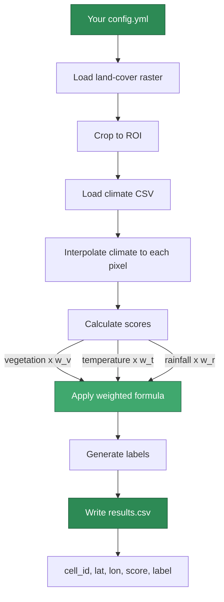

# TerraFlow in 10 Minutes

Everything you need to go from zero to a working suitability map — what it is, why it exists, how it works, and a live run you can follow along with.

---

## What is TerraFlow?

TerraFlow is a command-line tool that answers one question:

> **"Given a piece of land, how suitable is it for a particular crop or use — right now, given the current climate?"**

It takes three inputs:

| Input | What it is | Example |
|---|---|---|
| A land-cover map (raster) | A satellite-derived map of the land, broken into pixels | USDA Cropland Data Layer (CDL) |
| A climate data file | Temperature and rainfall readings from nearby weather stations | CSV with lat, lon, mean_temp, total_rain |
| A configuration file | Your choices: which region, what crop thresholds, how many sites | `config.yml` |

And produces three outputs under `output_dir/runs/<fingerprint>/`:

| File | What it contains |
|---|---|
| `features.parquet` | Per-cell suitability features — canonical analysis-ready format |
| `manifest.json` | Full provenance: config snapshot, input SHA-256 fingerprints, DataCatalog metadata |
| `report.json` | QA summaries: coverage fraction, nodata counts, step timings |

A backward-compatible `results.csv` (same data as Parquet) is also written to the same run directory.

---

## Why does it exist?

Assessing land suitability is traditionally done by hand — an agronomist looks at soil maps, calls the local weather office, and applies expert judgment to a spreadsheet. That process is:

- **Slow** — days or weeks for a single region
- **Inconsistent** — different analysts reach different conclusions
- **Not reproducible** — the next analyst can't trace exactly what was done

TerraFlow makes it:

- **Fast** — seconds for hundreds of locations
- **Consistent** — same config always gives same result
- **Fully reproducible** — every run is fingerprinted; two people with the same config and data get byte-identical outputs

---

## How does the pipeline work?



!!! tip "Key Design Choices"
    - **WGS84 output**: Coordinates are always in WGS84 degrees (lat/lon) regardless of input projection
    - **Reproducible sampling**: Same config + data always produces identical output via SHA-256 fingerprint seeding
    - **Portable configs**: Relative paths resolve relative to the config file location, not working directory

---

## Try it now (5 commands)

=== "Quick Start (CLI)"

    ```bash
    # 1. Clone and install
    git clone https://github.com/gmarupilla/AgroTerraFlow.git
    cd AgroTerraFlow
    pip install -e ".[dev]"

    # 2. Get the demo raster (see "Demo raster" section below)
    make get-demo-data

    # 3. Run the demo
    terraflow -c examples/demo_config.yml

    # 4. Look at the results (run dir named after fingerprint)
    ls outputs/demo_run/runs/
    # → <run_fingerprint>/
    #     features.parquet  manifest.json  report.json  results.csv
    ```

=== "Python Module"

    ```python
    from pathlib import Path
    import pandas as pd
    from terraflow.pipeline import run_pipeline

    df = run_pipeline("examples/demo_config.yml")

    # Locate the run directory from the returned DataFrame attrs
    run_dir = Path(df.attrs["run_dir"])
    print(f"Run fingerprint: {df.attrs['run_fingerprint']}")

    # Read canonical Parquet output
    features = pd.read_parquet(run_dir / "features.parquet")
    print(features.head())
    ```

Expected output (values will vary by sampled cells):

```
cell_id,lat,lon,v_index,mean_temp,total_rain,score,label
0,39.14,-100.82,87.0,20.3,142.1,0.71,high
1,38.55,-99.20,42.0,19.8,138.4,0.44,medium
2,39.88,-97.61,12.0,20.1,135.9,0.23,low
...
```

---

## Demo raster

The demo uses a clip from the **USDA Cropland Data Layer (CDL) 2025** —
a publicly available, public domain land-cover map published annually by
the USDA National Agricultural Statistics Service (NASS).

`data/usda_cdl.tif` is not stored in the repository. Obtain it one of two ways:

### Option A — Generate synthetic (offline, instant)

```bash
make get-demo-data
```

Creates a CDL-compatible synthetic GeoTIFF with realistic crop codes
(corn, soybeans, winter wheat, sorghum, grass/pasture) in the same
geographic extent and projection as the real file. Sufficient for all
demos, tests, and development work.

### Option B — Download real USDA CDL data from CropScape

To reproduce results using the exact government dataset:

1. Go to **<https://nassgeodata.gmu.edu/CropScape/>**
2. In the top toolbar, click **"Download Data"**
3. Draw a rectangle over western Kansas, or click **"Define Area by Coordinates"**
   and enter:

    | Field | Value |
    |---|---|
    | West (xmin) | `-101` |
    | East (xmax) | `-94` |
    | South (ymin) | `38` |
    | North (ymax) | `40` |

4. In the download dialog that appears, select the **CDL** tab *(not Freq or Mask)*
5. Set **Year** to `2025`
6. Set **Projection** to `USA Contiguous Albers Equal Area Conic USGS`
   *(the default — TerraFlow reprojects automatically)*
7. Click **Submit** and wait for the download
8. Extract the `.tif` from the zip and save it as:

    ```
    data/usda_cdl.tif
    ```

Then run:

```bash
terraflow -c examples/demo_config.yml
```

!!! note "Citation"
    When using real CDL data in published work, cite as:
    USDA National Agricultural Statistics Service (2025). *Cropland Data Layer, 2025.*
    Accessed via CropScape. <https://nassgeodata.gmu.edu/CropScape/>

---

## What the output columns mean

| Column | Meaning |
|---|---|
| `run_id` | `run_fingerprint` — links this row to `manifest.json` |
| `cell_id` | Index of the sampled pixel within your ROI |
| `lat` / `lon` | Geographic coordinates in WGS84 degrees |
| `v_index` | Raw value from the land-cover raster at this pixel |
| `mean_temp` | Interpolated temperature (°C) at this location |
| `total_rain` | Interpolated rainfall (mm) at this location |
| `score` | Suitability score from 0 (worst) to 1 (best) |
| `label` | Human-readable tier: `low` / `medium` / `high` |

---

## Configuring for your crop

The config file controls everything. Here is a minimal example:

```yaml title="config.yml"
raster_path: "../data/my_land_cover.tif"  # (1)!
climate_csv: "../data/weather_stations.csv"  # (2)!
output_dir: "../outputs/my_run"

roi:  # (3)!
  type: bbox
  xmin: -101.0   # West boundary (longitude)
  ymin: 38.0     # South boundary (latitude)
  xmax: -94.0    # East boundary (longitude)
  ymax: 40.0     # North boundary (latitude)

model_params:  # (4)!
  v_min: 0.0     # Lowest acceptable vegetation index
  v_max: 255.0   # Highest vegetation index in your raster
  t_min: 10.0    # Minimum suitable temperature (°C)
  t_max: 35.0    # Maximum suitable temperature (°C)
  r_min: 100.0   # Minimum suitable annual rainfall (mm)
  r_max: 800.0   # Maximum suitable annual rainfall (mm)
  w_v: 0.4       # Weight for vegetation score (must sum to 1.0)
  w_t: 0.3       # Weight for temperature score
  w_r: 0.3       # Weight for rainfall score

max_cells: 500   # How many locations to sample  # (5)!
```

1. Path to your land-cover GeoTIFF. Relative paths resolve from config file location.
2. CSV with columns: `lat`, `lon`, `mean_temp`, `total_rain` for weather stations.
3. Region of interest bounding box in WGS84 degrees (longitude/latitude).
4. Crop-specific thresholds defining optimal ranges for vegetation, temperature, and rainfall.
5. Number of random locations to sample within the ROI for analysis.

Save this as `config.yml` and run:

```bash
terraflow -c config.yml
```

---

## What happens next?

| I want to… | Go to… |
|---|---|
| Understand the results without writing code | [Field Guide](field-guide.md) |
| Customise the config in detail | [Configuration Schema](config/schema.md) |
| Contribute to the codebase | [Development Guide](DEVELOPMENT.md) |
| Understand the architecture and design decisions | [Architecture Overview](architecture/overview.md) |
| Track open issues and improvements | [GitHub Issues](https://github.com/gmarupilla/AgroTerraFlow/issues) |
