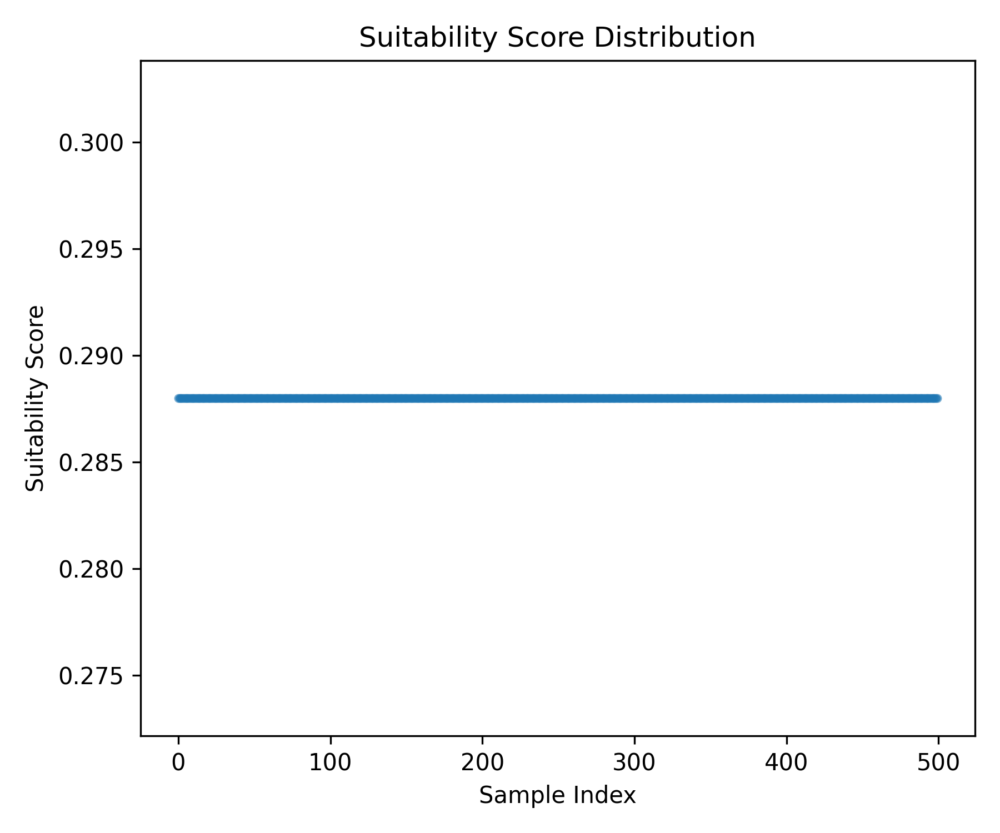

# Summary

TerraFlow is an open-source Python library designed to simplify reproducible
geospatial workflows in agriculture and environmental data science. It provides
a modular pipeline for loading raster datasets, clipping them to a region of
interest, merging them with climate data, computing cell-level suitability
scores, and exporting results for interpretation and visualization.

Many agricultural modeling projects require similar preparatory workflows but
re-implement them ad hoc, leading to inconsistent, hard-to-reproduce results.
TerraFlow provides a minimal, tested, configuration-driven pipeline that enables
users to execute geospatial workflows consistently across environments.



# Statement of Need

Geospatial agricultural workflows often combine public raster products such as
the USDA Cropland Data Layer (CDL) with climate summaries or tabular datasets.
These workflows require:

- reading geospatial rasters,
- validating user configuration,
- clipping to a region of interest,
- computing features or suitability indices,
- exporting maps and tables.

While existing libraries (`pandas`, `rasterio`, Plotly, Pydantic) provide
excellent building blocks, there is a gap between those low-level tools and a
clean, reproducible, end-to-end workflow. TerraFlow fills this gap by providing:

1. A fully reproducible reference pipeline.
2. A Pydantic-based configuration model for clarity and versioning.
3. Modularity via the separation of ingestion, geospatial logic, modeling and visualization layers.
4. Safe fallback behavior when ROIs lie outside raster extents.
5. Automated tests and CI for scientific software reliability.
6. Optional Docker execution for consistent environments.



# Software Description

## Architecture and Design

### `config`
Validates all configuration fields using Pydantic, including raster paths,
climate paths, ROI coordinates, max sample counts, and output directories.

### `ingest`
Loads:
- raster datasets via `rasterio`,
- climate tables via `pandas`.

### `geo`
Handles:
- ROI clipping using `rasterio.mask`,
- bounding box validation,
- fallbacks when the ROI is out-of-bounds.

### `model`
Implements a simple but transparent suitability model that:
- normalizes vegetation, rainfall, and temperature features,
- computes a suitability score in the range \[0, 1\],
- assigns a categorical label (`low`, `medium`, `high`).

### `pipeline`
Coordinates the full workflow:

1. Load config and validate it.
2. Ingest raster and climate data.
3. Clip raster to ROI (or fallback).
4. Sample valid cells.
5. Compute suitability features.
6. Write `results.csv`.
7. Optionally render Plotly visualizations.

### `viz`
Produces interactive HTML maps using Plotly.

# Example Usage

Run the demo pipeline:

```bash
make run-demo
```

This generates:

- `results.csv` with suitability scores,
- an optional interactive HTML map,
- optional summary plots for publications.

Below is an example histogram generated using the demo output:



# Reproducibility

TerraFlow emphasizes reproducible scientific workflows:

- declarative configuration,
- deterministic sampling,
- continuous integration via GitHub Actions,
- pinned dependencies,
- optional Docker-based execution,
- modular architecture.

Together, these features ensure that workflows can be executed uniformly across different machines, environments, or collaborators.

# Future Work

Possible extensions include:

- ML-based yield prediction models,
- STAC/COG integration for scalable geospatial retrieval,
- adding soil, elevation, and NDVI layers,
- uncertainty modeling or ensemble approaches,
- cloud batch workflows,
- educational notebooks for teaching geospatial modeling concepts.

# Acknowledgements

TerraFlow builds on the scientific Python ecosystem including `rasterio`,
`pandas`, Pydantic, and Plotly. Sample raster data for demonstrations originates
from the USDA National Agricultural Statistics Service (NASS) Cropland Data Layer.

# References
