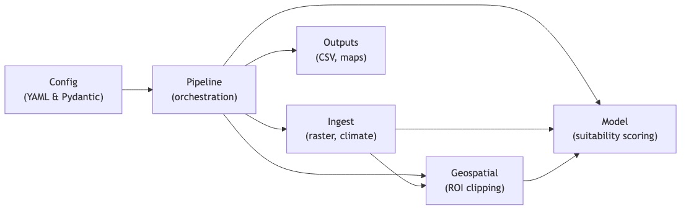
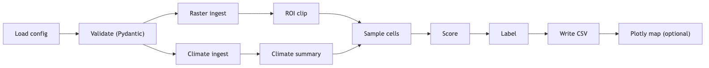

# Summary

TerraFlow is an open-source Python library designed to simplify reproducible geospatial workflows in agriculture and environmental data science. It provides a modular pipeline for loading raster datasets, clipping them to a region of interest (ROI), merging them with climate data, computing cell-level suitability scores, and exporting results for interpretation and visualization.

Many agricultural modeling projects require similar preparatory workflows but re-implement them ad hoc, leading to inconsistent, hard-to-reproduce results. TerraFlow provides a minimal, tested, configuration-driven pipeline that enables users to execute geospatial workflows consistently across environments.



# Statement of Need

Geospatial workflows in agriculture often combine public raster products such as the USDA Cropland Data Layer (CDL) [@usda_cdl] with tabular climate summaries or management data. Typical tasks include:

- reading geospatial rasters,
- validating user configuration,
- clipping to a region of interest,
- computing features or suitability indices,
- exporting maps and tables.

Widely used Python libraries such as `pandas` [@mckinney2010pandas], `rasterio`[@gillies2013rasterio], Pydantic [@pydantic], and Plotly [@plotly] provide excellent building blocks. However, there is a gap between these low-level tools and a clear, reproducible, end-to-end workflow that integrates configuration, ingestion, geospatial logic, modeling, and visualization in a maintainable way.

TerraFlow fills this gap by providing:

1. A fully reproducible reference pipeline.
2. A Pydantic-based configuration model for clarity and versioning.
3. Modularity via the separation of ingestion, geospatial logic, modeling, and visualization layers.
4. Safe fallback behavior when ROIs lie outside raster extents.
5. Automated tests and continuous integration for scientific software reliability.
6. Optional Docker execution for consistent environments across machines.



# Software Description

## Architecture and Design

### `config`

Validates all configuration fields using Pydantic [@pydantic], including raster paths, climate paths, ROI coordinates, maximum sample counts, and output directories. This makes the pipeline configuration explicit and version-controlled.

### `ingest`

Loads raster datasets via `rasterio` [@gillies2013rasterio] and climate tables via `pandas` [@mckinney2010pandas]. The ingest layer isolates file I/O from the rest of the pipeline and provides well-defined data structures downstream.

### `geo`

Handles ROI clipping and spatial operations:

- bounding box validation,
- ROI clipping using `rasterio.mask` [@gillies2013rasterio],
- fallbacks when the ROI is out-of-bounds.

This keeps geospatial logic localized and testable.

### `model`

Implements a simple but transparent suitability model that:

- normalizes vegetation, rainfall, and temperature features,
- computes a suitability score in the range \[0, 1\],
- assigns a categorical label (`low`, `medium`, `high`).

Although intentionally simple, this model demonstrates how TerraFlow can host more complex domain-specific models, including crop, hydrological, or risk-focused analyses.

### `pipeline`

Coordinates the full workflow:

1. Load and validate configuration.
2. Ingest raster and climate data.
3. Clip raster to ROI (or fall back to the full raster if needed).
4. Sample valid cells up to a configurable limit.
5. Compute suitability features for each sampled cell.
6. Write `results.csv` to disk.
7. Optionally trigger the visualization layer.

The pipeline module provides the main entry point for command-line execution.

### `viz`

Produces interactive HTML maps using Plotly [@plotly]. These maps can be used for exploratory analysis, communication with stakeholders, or teaching.

# Example Usage

The repository includes a demonstration configuration:

```bash
make run-demo
```

Running this command generates:

results.csv with per-cell suitability scores, and an optional interactive HTML map if the visualization step is enabled. Because the configuration file controls all file paths, ROI bounds, and model parameters, users can adapt the demo to other raster products, regions, or climate datasets without modifying library code.

# Reproducibility

TerraFlow emphasizes reproducible scientific workflows through: declarative, validated configuration using Pydantic [@pydantic], deterministic sampling of raster cells, continuous integration with automated tests, pinned dependencies and optional Docker-based execution, a modular architecture that separates concerns and reduces hidden state. These features help ensure that workflows can be executed uniformly across different machines, environments, and collaborators.

# Future Work

Possible extensions include:

ML-based yield or risk prediction models, STAC/COG integration for scalable geospatial retrieval, adding soil, elevation, and NDVI layers, uncertainty modeling or ensemble approaches, cloud batch workflows for large-scale processing, educational notebooks for teaching geospatial modeling concepts.

# Acknowledgements

TerraFlow builds on the scientific Python ecosystem including rasterio[@gillies2013rasterio], pandas [@mckinney2010pandas], Pydantic [@pydantic], and Plotly [@plotly]. Sample raster data for demonstrations originates from the USDA National Agricultural Statistics Service Cropland Data Layer [@usda_cdl].

References
