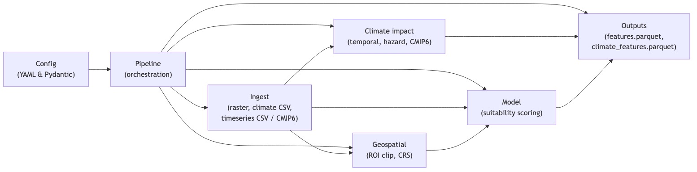
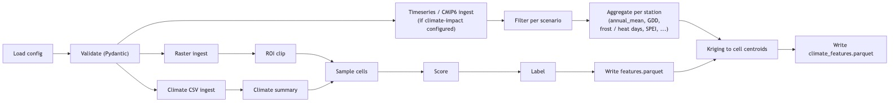

# Summary

TerraFlow is an open-source Python library for **reproducible
climate-impact assessment of agricultural suitability** — including
climate-induced crop hazards (drought, flood, heat stress, growing-degree-day
shifts) under historical and projected future climate. It turns a
land-cover raster, a climate dataset (weather-station observations or
CMIP6 NetCDF scenarios), and a YAML configuration into a scored per-cell
suitability table with complete, machine-readable provenance and per-cell
uncertainty intervals. A single `terraflow run` clips the raster to a
region of interest, reprojects it to WGS84, spatially interpolates
station climate to cell centroids (linear, inverse-distance, or Ordinary
Kriging with automatic variogram selection), computes a normalised
weighted suitability score, and writes `features.parquet`,
`manifest.json`, and `report.json` to a content-addressable run
directory. Companion sub-commands extend the same contract:
`terraflow sensitivity` and `terraflow validate` produce Sobol' and
Morris indices [@herman2017salib; @saltelli2008global] and spatial-block
cross-validation. Every run is identified by a deterministic
content-addressable `run_fingerprint`, so identical inputs produce the
same directory name and bit-identical outputs within documented limits.
The same workflow methodology extends to habitat suitability, land-use
planning, and conservation siting as adjacent expansion chapters.

{ width=85% }

# Statement of need

Climate-impact projections for agricultural suitability sit at the
intersection of three data sources — land-cover rasters (e.g. the USDA
Cropland Data Layer [@usda_cdl]), point weather observations or
CMIP6 climate scenarios, and crop-specific physiological thresholds.
Practitioners stitch these together in ad-hoc notebooks that
re-implement ROI clipping, CRS alignment, station-to-cell interpolation,
nodata accounting, scenario aggregation, and export on every project.
The consequence is a workflow-level reproducibility gap that is
especially acute for *climate-impact* questions: results depend on
file paths, package versions, random seeds, and — for projected climate
— the specific CMIP6 variant and time slice that drift silently between
runs; interpolation uncertainty and parameter sensitivity are rarely
quantified; and reviewers cannot regenerate a specific figure from a
specific configuration and specific input bytes.

TerraFlow closes this gap with a single configuration-driven pipeline
that fingerprints every run from the canonicalised YAML config plus
SHA-256 content hashes of every input; supports Ordinary Kriging with
leave-one-out variogram selection and propagates per-cell kriging
standard deviation into Monte-Carlo confidence intervals; and ships
sensitivity analysis and spatial-block validation as first-class
subcommands whose outputs share the run directory.

# State of the field

Several tools cover parts of this pipeline but none cover it end-to-end
with provenance and uncertainty as first-class concerns.
`rasterstats` [@rasterstats] computes zonal
statistics from raster-vector pairs but offers neither CRS
normalisation nor climate interpolation nor provenance. `rioxarray` /
`xarray` [@rioxarray; @hoyer2017xarray] provide N-dimensional raster
operations but leave pipeline assembly to the user. Google Earth
Engine [@gorelick2017gee] enables planetary-scale analysis but requires
internet access and a Google account, ruling it out for the air-gapped
environments common in government and agricultural workflows. `QGIS`
[@qgis] is interactive, not scripted. `rasterio` [@gillies2013rasterio]
and `pandas` [@mckinney2010pandas] are building blocks without
top-level orchestration.

We built TerraFlow rather than contributing to these libraries because
reproducibility and uncertainty propagation are architectural concerns
that span ingest, clipping, interpolation, scoring, and export, and
cannot be bolted onto a statistics or tiling library without a top-level
orchestration contract.

# Software design

TerraFlow is organised into modules with strict contracts
[@wilson2017good].

**Core pipeline.** `config` validates the YAML configuration with
Pydantic [@pydantic] before any I/O runs. `ingest` builds a
`DataCatalog` — an immutable metadata snapshot of each layer's CRS,
bounds, nodata value, shape, and SHA-256 — without reading pixel
arrays, separating availability checks from computation. `geo`
performs windowed ROI clipping and CRS reprojection via `pyproj`.
`climate` implements three spatial-interpolation strategies; the
kriging path uses `pykrige` and selects among spherical, exponential,
Gaussian, and optionally nested variogram candidates
[@cressie1993spatial] by leave-one-out cross-validation RMSE.
`model` computes the normalised weighted suitability score. `pipeline`
seeds `numpy.random.default_rng` from the SHA-256 of the run
fingerprint, samples up to `max_cells` valid cells, and writes
artifacts atomically. `sensitivity` and `validation` consume the same
`DataCatalog`, so every analysis is pinned to the exact inputs
recorded in the manifest. Two design choices matter most: artifacts
are schema-versioned (the pipeline invalidates a cached run on stale
`terraflow_schema_version`), and the `run_fingerprint` excludes file
mtimes and absolute paths so the same content hashes produce the same
fingerprint across machines and filesystem copies.

{ width=85% }

# Research impact statement

TerraFlow addresses a workflow-level reproducibility gap in
agricultural and environmental geospatial modelling: the gap between
*input* fingerprinting (which several existing tools already provide)
and *workflow* fingerprinting that covers the climate-interpolation
strategy, score-model parameters, sensitivity-analysis settings, and
spatial-validation reference set. This gap matters most where
audit-quality reproduction is part of the deliverable:
precision-agriculture decision support, food-security and climate
adaptation planning, and agronomy education where students must
reproduce a published result before extending it.

The contract is enforced by a substantial validation surface across the
climate, sensitivity, validation, and export modules; an **85 % coverage
floor**; a type-checked CI matrix on Python 3.10–3.12; and a Dockerfile
whose smoke test runs the demo with `docker run --network none` and
asserts that `features.parquet`, `manifest.json`, and `report.json` land
under the mounted output directory **without any network access**. The
fingerprint contract is documented byte-by-byte on a dedicated
reproducibility page, including known sources of non-determinism
(`scipy` variogram-fit drift across versions, `qhull` triangulation
tie-breaking, BLAS-dependent summation order).

To make these guarantees concrete, we report the metrics produced by
a single end-to-end run of the bundled demo on `examples/demo_config.yml`.
The demo ROI spans ~608 km × 233 km of western Kansas; a 20-station
synthetic climate network is interpolated to 2 000 sampled raster
cells:

| Stage | Metric | Value |
|-------|--------|-------|
| Pipeline | Sampled cells / valid cells in ROI | 2 000 / 137 592 (97 % coverage) |
| Pipeline | Total wall-clock runtime | 0.35 s |
| Kriging  | Selected variogram model | spherical |
| Kriging  | LOOCV RMSE, `mean_temp` | 0.29 °C |
| Kriging  | LOOCV RMSE, `total_rain` | 7.01 mm |
| Monte-Carlo | 90 % score CI mean width | 0.073 (n = 200 draws) |
| Sobol' | S1 indices (`w_v`, `w_t`, `w_r`) | 0.331, 0.333, 0.333 |
| Sobol' | ST indices (`w_v`, `w_t`, `w_r`) | 0.333, 0.333, 0.333 |
| Block CV | Mean fold accuracy (5 folds) | 0.48 |

Every number above is reproducible from `make get-demo-data &&
terraflow run -c examples/demo_config.yml` plus the two companion
subcommands; the published `run_fingerprint` is verifiable without
shared compute infrastructure.

To the authors' knowledge TerraFlow is the only open package that
composes Ordinary Kriging with LOOCV variogram selection, Monte-Carlo
uncertainty propagation, Sobol' and Morris sensitivity analysis, and
spatial-block cross-validation under a single deterministic provenance
scheme. The integration — not any one component — is the contribution.

# AI usage disclosure

The authors used Anthropic Claude — specifically the Claude Code
assistant invoking the `claude-opus-4-7` model for paper revisions, and
earlier Claude Sonnet 4.x / Opus 4.x for the v0.2.x – v0.3.0
climate-pipeline work — as a coding assistant during software
implementation, documentation, and manuscript drafting. The OpenAI Codex
GitHub App (`gpt-codex` model) provided automated pull-request feedback.
Every AI-suggested change was reviewed and edited by the human authors
before being committed. Core design decisions — the `DataCatalog`
boundary contract, the run-fingerprint hashing scheme, LOOCV variogram
selection, Monte-Carlo uncertainty propagation, and the artifact schema
— were made by the human authors. AI-assisted code is verified by the
project's automated tests on the Python 3.10/3.11/3.12 CI matrix, the
85 % coverage floor, SonarCloud static analysis, and GitHub Dependency
Review on every pull request.

# Acknowledgements

TerraFlow builds on the scientific Python ecosystem including
`rasterio` [@gillies2013rasterio], `pandas` [@mckinney2010pandas],
`pykrige`, SALib [@herman2017salib], scikit-learn, Pydantic
[@pydantic], Shapely [@shapely], `rasterstats` [@rasterstats], and
Apache Arrow [@pyarrow]. Sample raster data originates from the USDA
National Agricultural Statistics Service Cropland Data Layer
[@usda_cdl], which is in the public domain (17 U.S.C. § 105).

# References
